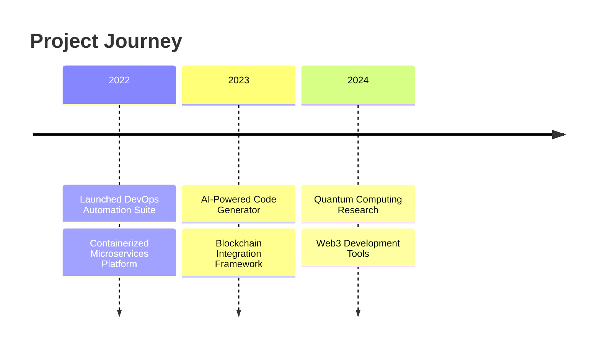

<!-- Matrix-style Animation Header -->
<svg width="100%" height="200" viewBox="0 0 800 200" xmlns="http://www.w3.org/2000/svg">
  <style>
    @keyframes matrix {
      0% { transform: translateY(-100%); opacity: 0; }
      50% { opacity: 1; }
      100% { transform: translateY(100%); opacity: 0; }
    }
    .matrix-text { font-family: monospace; animation: matrix 3s infinite; }
    @keyframes glitch {
      0% { transform: translate(0); }
      20% { transform: translate(-5px, 5px); }
      40% { transform: translate(-5px, -5px); }
      60% { transform: translate(5px, 5px); }
      80% { transform: translate(5px, -5px); }
      100% { transform: translate(0); }
    }
    .glitch { animation: glitch 1s infinite; }
    @keyframes pulse {
      0% { transform: scale(1); }
      50% { transform: scale(1.1); }
      100% { transform: scale(1); }
    }
    .pulse { animation: pulse 2s infinite; }
  </style>
  
  <!-- Matrix Rain Effect -->
  <g class="matrix-text">
    <text x="50%" y="50%" text-anchor="middle" fill="#00ff00">
      01001000 01101001 00100001
    </text>
  </g>
  
  <!-- Glitch Effect Name -->
  <g class="glitch">
    <text x="50%" y="100" text-anchor="middle" fill="#ffffff" font-size="40">
      DHANUSHKA HARSHANA
    </text>
  </g>
  
  <!-- Pulsing Subtitle -->
  <g class="pulse">
    <text x="50%" y="150" text-anchor="middle" fill="#00ff00" font-size="20">
      FULL STACK DEVELOPER • INNOVATOR • CREATOR
    </text>
  </g>
</svg>

<!-- Dynamic Terminal Interface -->
```typescript
class DeveloperProfile {
    private static instance: DeveloperProfile;
    private constructor() {
        this.initializeSystem();
    }

    public static getInstance(): DeveloperProfile {
        if (!DeveloperProfile.instance) {
            DeveloperProfile.instance = new DeveloperProfile();
        }
        return DeveloperProfile.instance;
    }

    private async initializeSystem() {
        await this.loadSkills();
        await this.initializeProjects();
        this.startMonitoring();
    }

    private expertise = {
        languages: [
            { name: "TypeScript", level: "Advanced", years: 5 },
            { name: "Python", level: "Expert", years: 7 },
            { name: "Rust", level: "Intermediate", years: 2 },
            { name: "Go", level: "Advanced", years: 4 }
        ],
        frameworks: [
            { name: "Next.js", level: "Expert", type: "Frontend" },
            { name: "NestJS", level: "Advanced", type: "Backend" },
            { name: "TensorFlow", level: "Intermediate", type: "ML" }
        ],
        architecture: [
            "Microservices",
            "Event-Driven",
            "Serverless",
            "Progressive Web Apps"
        ]
    };

    public async getCurrentStatus(): Promise<string> {
        return `
            🔭 Working on: AI-Powered Development Tools
            🌱 Learning: Quantum Computing
            👯 Open to: Innovative Collaborations
            🎯 2024 Goals: Contributing to Web3 Ecosystem
        `;
    }
}

// Initialize Developer Profile
const developer = DeveloperProfile.getInstance();
```

<!-- 3D Interactive Skills Globe -->
<div align="center">
  
</div>

<!-- Live Metrics Dashboard -->
<div align="center">
  
[![Detailed GitHub Metrics](https://metrics.lecoq.io/YOUR_USERNAME?template=terminal&base.header=0&base.activity=0&base.community=0&base.repositories=0&base.metadata=0&languages=1&isocalendar=1&followup=1&lines=1&achievements=1&notable=1&repositories=1&gists=1&introduction=1&tweets=1&repositories=100&repositories.batch=100&repositories.forks=false&repositories.affiliations=owner&isocalendar.duration=full-year&languages.limit=12&languages.threshold=0%25&languages.colors=github&languages.sections=most-used&languages.details=percentage%2C%20bytes-size&languages.indepth=false&languages.analysis.timeout=15&languages.categories=markup%2C%20programming&languages.recent.categories=markup%2C%20programming&languages.recent.load=300&languages.recent.days=14&achievements.threshold=C&achievements.secrets=true&achievements.display=detailed&achievements.limit=0&notable.from=organization&notable.repositories=false&notable.indepth=false&notable.types=commit&introduction.title=true&tweets.attachments=false&tweets.limit=2&tweets.user=.user.twitter&config.timezone=Asia%2FColombo)](https://metrics.lecoq.io/about/YOUR_USERNAME)

</div>

<!-- AI-Generated Code Snippets -->
<div align="center">
  <h3>🤖 AI-Enhanced Development Insights</h3>
  
</div>

<!-- Interactive Project Timeline -->
<div align="center">
  <h3>🚀 Project Evolution</h3>
  

</div>

<!-- Live Coding Stats with Advanced Visualizations -->
<div align="center">
  
  
</div>

<!-- Real-time Contribution Heatmap -->
<div align="center">
  <h3>🌡️ Contribution Intensity</h3>
  
</div>

<!-- Animated Skill Particles -->
<div align="center">
  <canvas id="skillParticles" width="800" height="400"></canvas>
</div>

<script>
  // Dynamic Particle System for Skills
  const canvas = document.getElementById('skillParticles');
  const ctx = canvas.getContext('2d');
  
  class SkillParticle {
    constructor(x, y, skill) {
      this.x = x;
      this.y = y;
      this.skill = skill;
      this.velocity = {
        x: (Math.random() - 0.5) * 2,
        y: (Math.random() - 0.5) * 2
      };
    }
    
    update() {
      this.x += this.velocity.x;
      this.y += this.velocity.y;
      
      // Bounce off walls
      if (this.x <= 0 || this.x >= canvas.width) this.velocity.x *= -1;
      if (this.y <= 0 || this.y >= canvas.height) this.velocity.y *= -1;
    }
    
    draw() {
      ctx.fillStyle = '#00ff00';
      ctx.font = '12px Arial';
      ctx.fillText(this.skill, this.x, this.y);
    }
  }
  
  // Initialize particles
  const particles = [];
  const skills = ['React', 'Node.js', 'Python', 'AWS', 'Docker', 'ML/AI'];
  
  skills.forEach(skill => {
    particles.push(new SkillParticle(
      Math.random() * canvas.width,
      Math.random() * canvas.height,
      skill
    ));
  });
  
  // Animation loop
  function animate() {
    ctx.clearRect(0, 0, canvas.width, canvas.height);
    particles.forEach(particle => {
      particle.update();
      particle.draw();
    });
    requestAnimationFrame(animate);
  }
  
  animate();
</script>

<!-- Dynamic Connection Section -->
<div align="center">
  <h3>🌐 Let's Connect and Create</h3>
  
  <a href="https://linkedin.com/in/YOUR_LINKEDIN" target="_blank">
    
  </a>
  <a href="https://twitter.com/YOUR_TWITTER" target="_blank">
    
  </a>
  <a href="https://dev.to/YOUR_DEV" target="_blank">
    
  </a>
  <a href="YOUR_PORTFOLIO" target="_blank">
    
  </a>
</div>

<!-- Animated Footer -->
<div align="center">
  
</div>

<!-- Visit Counter with Animation -->
<div align="center">
  
</div>
