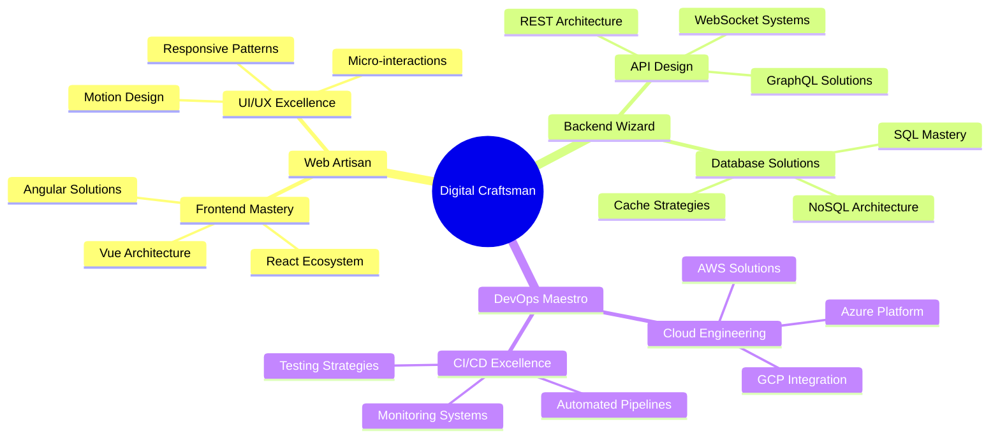

# <div align="center"></div>

<!-- Interactive Particle Background SVG -->
<svg width="100%" height="200" viewBox="0 0 800 200" fill="none" xmlns="http://www.w3.org/2000/svg">
    <defs>
        <filter id="glow">
            <feGaussianBlur stdDeviation="3.5" result="coloredBlur"/>
            <feMerge>
                <feMergeNode in="coloredBlur"/>
                <feMergeNode in="SourceGraphic"/>
            </feMerge>
        </filter>
        <linearGradient id="gradient" x1="0%" y1="0%" x2="100%" y2="0%">
            <stop offset="0%" style="stop-color:#FF0080"/>
            <stop offset="50%" style="stop-color:#FF8C00"/>
            <stop offset="100%" style="stop-color:#40E0D0"/>
            <animate attributeName="x1" from="0%" to="100%" dur="10s" repeatCount="indefinite"/>
            <animate attributeName="x2" from="100%" to="200%" dur="10s" repeatCount="indefinite"/>
        </linearGradient>
    </defs>
    <style>
        .particle { animation: float 3s infinite ease-in-out; }
        .text-animated { font-family: 'Monaco', monospace; fill: url(#gradient); filter: url(#glow); }
        @keyframes float {
            0%, 100% { transform: translateY(0); }
            50% { transform: translateY(-20px); }
        }
        .code-line { 
            animation: type 4s steps(60) infinite;
            opacity: 0;
        }
        @keyframes type {
            0% { opacity: 0; transform: translateX(-10px); }
            10% { opacity: 1; transform: translateX(0); }
            90% { opacity: 1; transform: translateX(0); }
            100% { opacity: 0; transform: translateX(10px); }
        }
    </style>
    <text x="50%" y="50%" text-anchor="middle" class="text-animated code-line" font-size="24">
        console.log("Welcome to my digital universe 🚀");
    </text>
    <!-- Add animated particles -->
    <circle class="particle" cx="100" cy="100" r="3" fill="#FF0080"/>
    <circle class="particle" cx="200" cy="150" r="2" fill="#FF8C00" style="animation-delay: -1s"/>
    <circle class="particle" cx="300" cy="50" r="4" fill="#40E0D0" style="animation-delay: -2s"/>
    <!-- Add more particles as needed -->
</svg>

<!-- Digital Experience Matrix -->
<div align="center">
  


</div>

<!-- Live Tech Radar -->
<h2 align="center">💡 Technology Radar</h2>

```javascript
class TechnologyRadar {
    static categories = {
        ADOPT: ['Next.js', 'TypeScript', 'Tailwind CSS', 'Docker', 'GraphQL'],
        TRIAL: ['Rust', 'Web3', 'WebAssembly', 'Edge Computing'],
        ASSESS: ['AI Integration', 'Quantum Computing', 'AR/VR Development'],
        HOLD: ['Legacy Systems', 'Monolithic Architecture']
    };

    static getExpertise() {
        return {
            languages: {
                typescript: { level: 'Expert', years: 5 },
                python: { level: 'Advanced', years: 4 },
                rust: { level: 'Learning', years: 1 }
            },
            frameworks: {
                react: { level: 'Expert', years: 5 },
                vue: { level: 'Advanced', years: 3 },
                nest: { level: 'Expert', years: 3 }
            },
            architecture: {
                microservices: { level: 'Expert', years: 4 },
                eventDriven: { level: 'Advanced', years: 3 },
                serverless: { level: 'Expert', years: 3 }
            }
        };
    }
}
```

<!-- Advanced GitHub Metrics -->
<div align="center">
  
</div>

<div align="center">
  
  
</div>

<!-- Interactive Project Carousel -->
<h2 align="center">🎯 Featured Projects</h2>

<div align="center">
  <table>
    <tr>
      <td width="50%">
        <h3 align="center">Project 1</h3>
        <div align="center">
          <a href="https://github.com/YOUR_USERNAME/project1">
            
          </a>
          <p><a href="https://project1-demo.com">Live Demo</a></p>
        </div>
      </td>
      <td width="50%">
        <h3 align="center">Project 2</h3>
        <div align="center">
          <a href="https://github.com/YOUR_USERNAME/project2">
            
          </a>
          <p><a href="https://project2-demo.com">Live Demo</a></p>
        </div>
      </td>
    </tr>
  </table>
</div>

<!-- Dynamic Contribution Calendar -->
<h2 align="center">🌟 Contributions</h2>

[](https://github.com/ashutosh00710/github-readme-activity-graph)

<!-- 3D Contribution Calendar -->


<!-- Spotify Integration -->
<div align="center">
  
  [](https://open.spotify.com/user/YOUR_SPOTIFY_ID)
  
</div>

<!-- Animated Skill Bars -->
<h2 align="center">🎯 Skill Proficiency</h2>

<div align="center">


</div>

<!-- WakaTime Integration -->
<div align="center">
  
</div>

<!-- Achievement Showcase -->
<h2 align="center">🏆 Achievements</h2>

<div align="center">
  
</div>

<!-- Interactive Contact Section -->
<h2 align="center">🤝 Connect & Collaborate</h2>

<div align="center">
  <a href="https://linkedin.com/in/YOUR_LINKEDIN" target="_blank">
    
  </a>
  <a href="https://twitter.com/YOUR_TWITTER" target="_blank">
    
  </a>
  <a href="https://dev.to/YOUR_DEV" target="_blank">
    
  </a>
  <a href="mailto:your.email@example.com">
    
  </a>
</div>

<!-- Profile Views -->
<div align="center">
  
</div>

<!-- Animated Footer -->
<div align="center">
  
</div>

<!-- Inspirational Quote -->
<div align="center">
  
</div>

<!-- Custom Footer -->


<!-- Hidden Metrics Collection -->
![Metrics](https://metrics.lecoq.io/YOUR_USERNAME?template=terminal&base.header=0&base.activity=0&base.community=0&base.repositories=0&base.metadata=0&isocalendar=1&languages=1&stars=1&topics=1&habits=1&achievements=1&notable=1&discussions=1&repositories=1&code=1&followup=1&reactions=1&people=1&sponsors=1&repositories=100&repositories.batch=100&repositories.forks=false&repositories.affiliations=owner&isocalendar.duration=full-year&languages.limit=8&languages.threshold=0%25&languages.colors=github&languages.sections=most-used&languages.indepth=false&languages.analysis.timeout=15&languages.categories=markup%2C%20programming&languages.recent.categories=markup%2C%20programming&languages.recent.load=300&languages.recent.days=14&topics.mode=mastered&topics.sort=stars&topics.limit=15&stars.limit=4&habits.from=200&habits.days=14&habits.facts=true&habits.charts=false&habits.charts.type=classic&habits.trim=false&achievements.threshold=C&achievements.secrets=true&achievements.display=detailed&achievements.limit=0&notable.from=organization&notable.repositories=false&notable.inde
